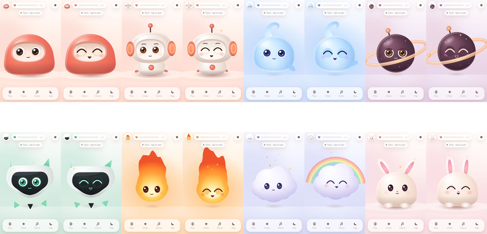
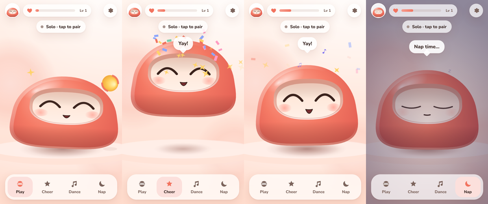
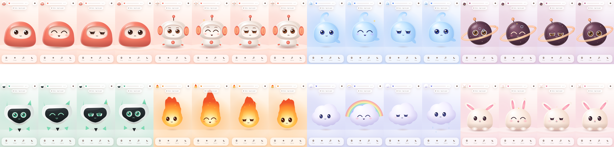

# Peek Pets

A little pet that lives on your iPhone and **watches your PC cursor**. Move the mouse on your
PC and the pet's eyes follow it on your phone, live. Tap it, pet it, play ball, make it
dance. When the PC is off, it naps, plays solo, and is glad when you come back.



* **Phone:** a web app (Safari, or installed to the Home Screen). No App Store needed.
* **PC:** *Peek Pets Companion*, a small Windows app that reads the cursor and serves the
  phone app over your Wi-Fi. Nothing goes to the internet; no account.

## Launch it (2 minutes)

**On the PC**
1. Double-click **`Peek Pets Companion`** on the Desktop (or `Start Peek Pets.cmd` in this folder).
2. If Windows asks about network access, tick **Private** *and* **Public** and click **Allow**.
   (Your Wi-Fi "PrettyFlyForAWiFi" is set to *Public*.) If the window shows an orange
   "may be blocked" banner, click **Fix it…**. It adds one rule: local-network devices only.

**On the iPhone** (same Wi-Fi)
1. Open the **Camera**, point it at the big QR code in the companion window, tap the link.
2. That's it: the status pill turns green, *"Linked to LUKE-PC · 12 ms"*. Move your mouse.

No camera handy? Open Safari to the address shown (e.g. `http://10.0.0.206:8787`) and type
the 6-letter code. After the first pairing the phone reconnects by itself every time the
companion is running. No code needed again.

**Stop:** close the companion window. The phone immediately shows *"PC app closed · waiting"*
and reconnects on its own when you start it again.

### Optional: make it a real app on the Home Screen
Scan the **small QR** ("Install as an app") in the companion window and follow the 4 steps.
You trust a private certificate once (it is **name-constrained to home-network addresses**,
so it can't vouch for real websites). Before trusting it, compare the fingerprint the
iPhone shows (*profile → More Details → SHA-256*) with the one in the companion window.
Then *Share → Add to Home Screen*. The installed app:
* opens full-screen with the Peek Pets icon,
* **works with the PC off** (offline copy; the pet plays solo and reconnects when the PC is back),
* can keep the screen awake properly.

Quick Safari mode needs none of this, but it runs over plain HTTP: someone snooping on your
Wi-Fi could see the cursor stream and the pairing token. On a trusted home network that's
fine; the installed app encrypts everything. Remove the certificate any time in
*Settings → General → VPN & Device Management*.

## Things to try
| Do this | The pet… |
|---|---|
| Move the PC mouse | follows with its eyes (head leans after) |
| Fling the mouse fast | startles |
| Draw fast circles with the mouse | gets dizzy |
| Click on the PC | blinks / flinches |
| Tap it | boops & giggles · 5 quick taps = dizzy |
| Tap an eye | "Hey! My eye!" |
| Stroke it with a finger | purrs, hearts |
| Press and hold | hug |
| Double-tap | hops for joy |
| Drag a finger on the background | watches your finger |
| **Play** | a ball to flick around: the pet tracks it and bonks it back |
| **Cheer / Dance / Nap** | confetti, a little dance with a tune, lights-down nap |



| Leave it alone ~2 min | gets sleepy, then naps (faster at night). Wakes when you return |
| Close the PC app | looks around for it, then settles. Never sulks |
| Avatar (top-left) | switch between 12 pets, each with its own bond level |
| **Snack** | pick a treat: it arcs into the pet's mouth, chomp chomp. Every pet has a favourite; chili is a joke (except for Ember) |
| **Style** (hanger, top bar) | wardrobe (8 hats & glasses, unlocked by bond), six painted **backdrops**, and **📸 photo mode** (a polaroid to save or share) |
| Shake the phone | dizzy pet (Settings → **Shake & tilt**). Tilt it: the pet leans and the ball rolls downhill |

The PC window also has **Say something**: type a line and the pet says it on the phone
(the hook future AI features will use), plus toggles for exactly what the PC shares.

## Pets
| | |
|---|---|
| **Mochi** | the coral daruma from the simple-eyes sheet (default) |
| **Pip** | cream/coral robot: glowing headphone ears, springy antenna, brows |
| **Nimbus** | glowing blue jelly with a curly tail; shimmers and bubbles |
| **Plum** | starry orb with a 3-D orbiting ring and a tiny moon |
| **Sprig** | mint/charcoal visor bot with glowing eyes and floating limbs |
| **Ember** | flame sprite: fire grows when happy, embers when sleepy |
| **Puff** | cloud: drizzles while waiting for the PC, rainbow when overjoyed |
| **Bun** | marshmallow bunny with spring-physics floppy ears |
| **Inky** *(new)* | glowing jelly octopus with six curly arms |
| **Pebble** *(new)* | mossy stone golem with a sprout on a spring |
| **Lumi** *(new)* | fuzzy lilac moth on flapping glassy wings (glows more at night) |
| **Opal** *(new)* | chubby crystal dragon hatchling with shimmering horns |

**What's new in v0.3 (20-second video):** [docs/media/v3-whats-new.mp4](docs/media/v3-whats-new.mp4)



## iPhone app & Mac
* Real iPhone app: [docs/NATIVE-APP.md](docs/NATIVE-APP.md) (Sideloadly or TestFlight from Windows).
* **Have a Mac?** [docs/MAC-SETUP.md](docs/MAC-SETUP.md): clone, double-click `Set up on Mac.command`, press ▶ in Xcode.
* Art: [docs/ART-PROMPTS.md](docs/ART-PROMPTS.md) is a ChatGPT/Kling prompt pack for more backdrops, pets and icons.

## For developers
```
companion/         Windows companion (.NET 8 WPF + Kestrel): cursor sampler, pairing, facts, HTTPS app mode
companion.tests/   xUnit: pairing/auth/rate limits, multi-monitor mapping, LAN guard, wire format, CA constraints
phone/             the phone app (vanilla ES modules + Canvas 2D, no build step)
  js/core/         pure logic: springs, gaze mapping, mood reducer, protocol, backoff, bond
  js/pet/          rig (animation), face (eyes/lids/mouth), renderer, physics, species/*
tests/phone/       node:test unit tests for js/core
tools/e2e/         Playwright: live-test (real cursor → phone), app-mode-test, gallery, icons
docs/              PROTOCOL.md, BUILD-RECORD.md, screenshots, recording
```
```
npm test                                  # phone logic (80 tests)
dotnet test companion.tests               # companion (98 tests)
node tools/e2e/live-test.mjs chromium     # end-to-end with your real cursor (moves your mouse!)
node tools/e2e/app-mode-test.mjs          # installable app + offline
node tools/e2e/actions-test.mjs          # dock actions, toys, petting, all pets (needs companion on :8787)
node tools/e2e/v3-test.mjs                # wardrobe, backdrops, snacks, shake & tilt, photo, new pets
node tools/video/film.mjs && node tools/video/render.mjs   # re-make the what's-new video
powershell -File tools/publish.ps1        # standalone companion for a friend (no .NET needed)
```
The companion serves `phone/` straight from this checkout, so edits show up on the phone after a refresh.
Protocol: [docs/PROTOCOL.md](docs/PROTOCOL.md) · What's done and what's next: [docs/BUILD-RECORD.md](docs/BUILD-RECORD.md)
