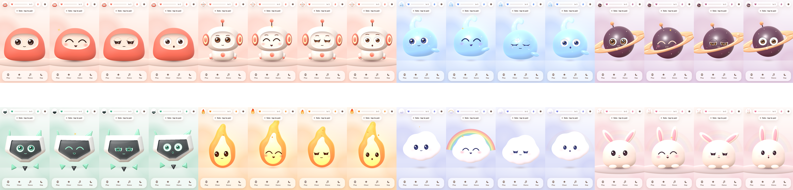
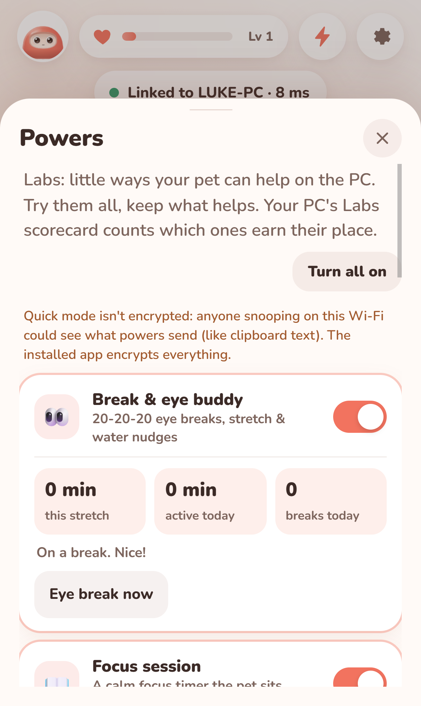
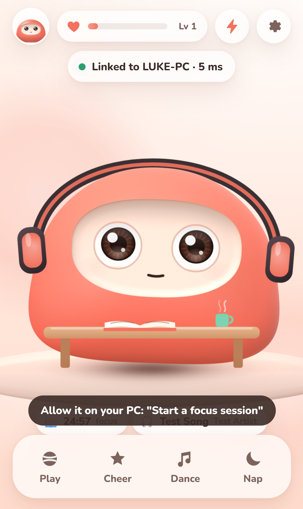
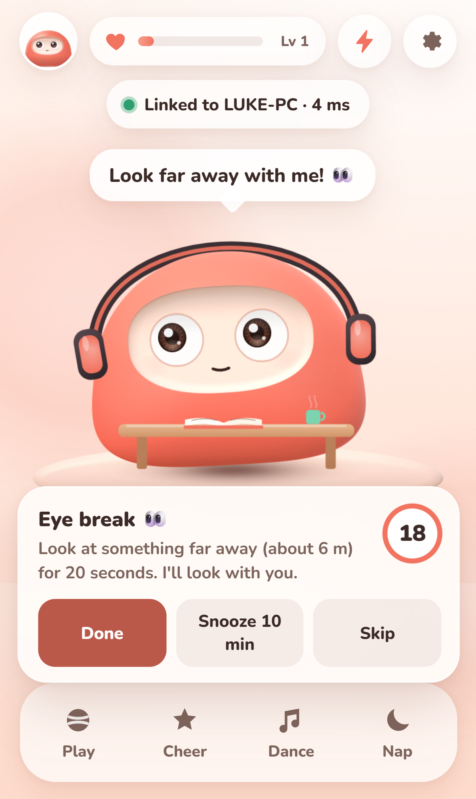
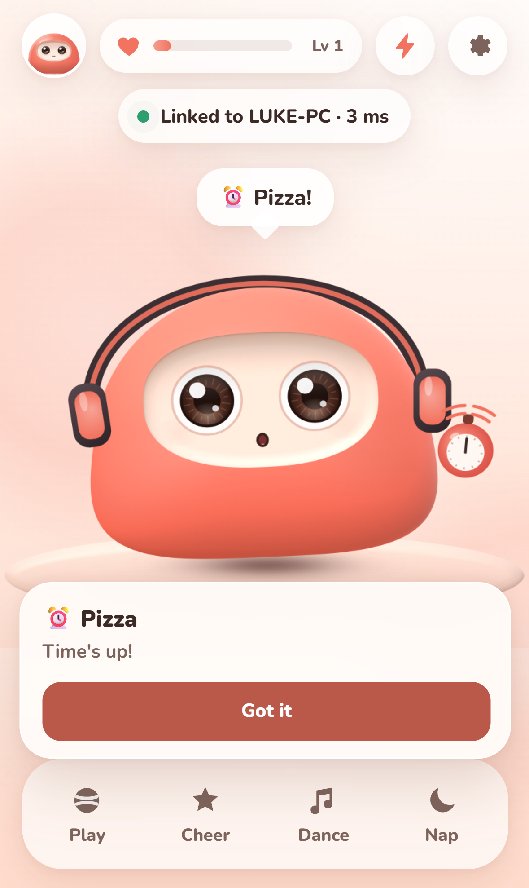
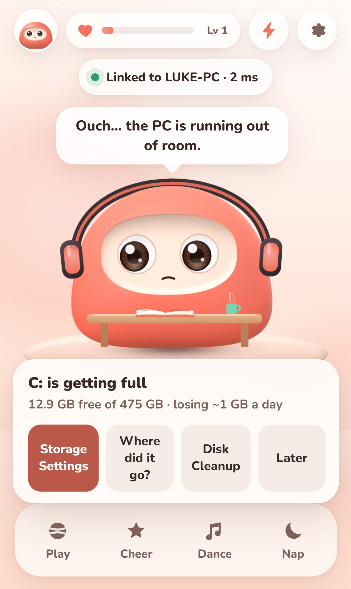
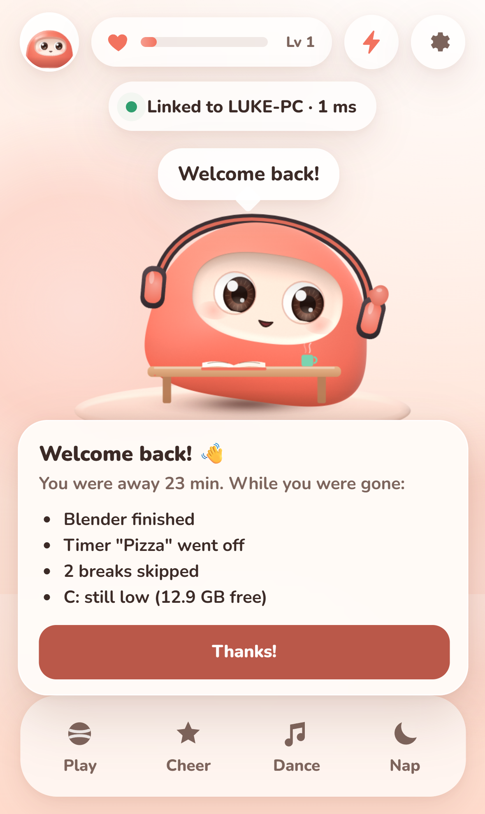
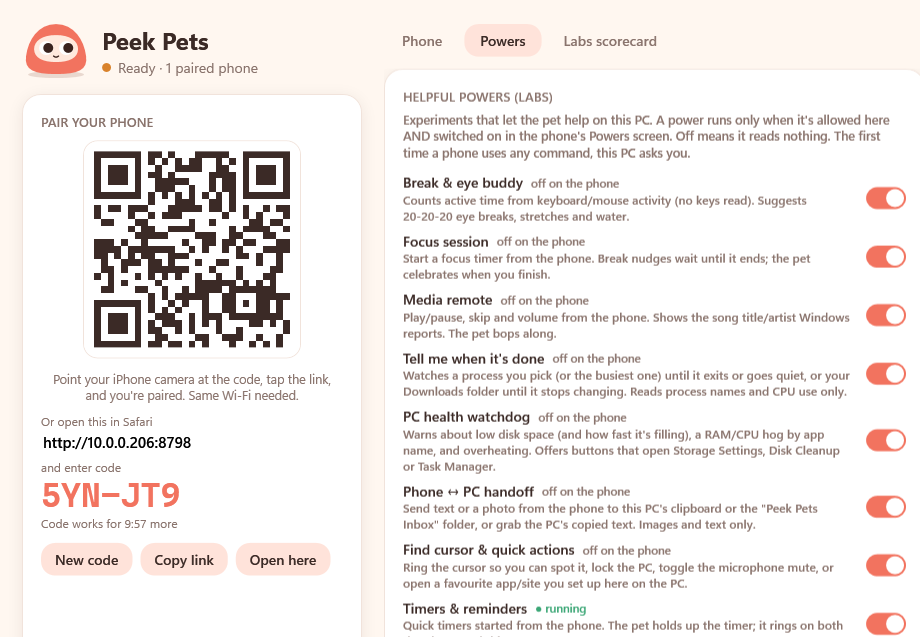
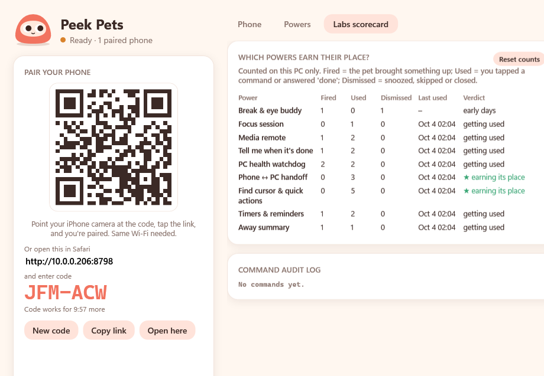

# Build record: Peek Pets

## v0.5: the companion runs on Mac too (2026-10-05)

*Request: "make it also run on Mac; many friends use Macs; put it on GitHub; easy to set up on a new Mac."*

| | |
|---|---|
| **Mac companion** | Same window as Windows (Phone tab): QR pairing, cursor/clicks/all monitors, battery + away facts, Say something, HTTPS app mode, Bonjour. Powers and the load fact come in Phase 2. |
| **Install for friends** | One Terminal line (`tools/mac/install-companion.sh`) downloads the `.app` from the `companion-latest` release into `~/Applications`. Self-contained, no .NET, Apple silicon + Intel. |
| **Developers** | Double-click `Start Peek Pets.command` (installs .NET 8 into `~/.dotnet` if missing). |
| **Code** | `companion.core/` (shared, OS seams in `Platform/`), `companion/` (WPF), `companion.mac/` (Avalonia). Windows behaviour unchanged. |
| **CI** | `companion.yml`: Windows build + tests, Mac tests + package + smoke test + installer test, release on `main`. |
| **New pet: Zoe** | Luke's black French bulldog, from a photo: glossy black clay coat, bat ears on springs (perk when surprised, airplane ears when sleepy), grizzled sugar-face muzzle, jowls that jiggle on landings, white chest blaze and white toes, head cocks toward the cursor, happy snort puffs. Favourite snack: cookie. |

### Verified
| Check | Result |
|---|---|
| Companion tests on macOS | **115/115** (98 existing + 17 Mac: displays, pmset, Bonjour TXT, key file permissions, live cursor) |
| Phone tests | 113/113 |
| Windows app compiles against the core (on the Mac) | 0 errors, 0 warnings |
| Mac app on a real Mac: pair, stream cursor, HTTPS chain to the local CA, Bonjour `_peekpets._tcp` | **pass** |
| `.app` bundle: serves the phone app, signature verifies; installer from the zip | **pass** |

### Not verified yet
* The Windows app running on Windows (CI job runs on the first push).
* A real iPhone against the Mac companion (the browser pane and a protocol client stood in).
* The `companion-latest` release (created on the first `main` build).

## v4: games, coins & shop, friends & chat, App Store prep (2026-10-04, afternoon)

*Your requests while at work: built-in games, XP from games (not from spamming the pet), a
currency and customizables, friends with codes, chat, playing with friends, leaderboards,
auto-allow for powers, a better find-cursor, new pets, images, and getting ready for the App
Store. All built and tested; the chat server needs one deploy from you (below).*

### Play
| | |
|---|---|
| **Play menu** | Ball, **Treat Catch** (slide to catch falling treats, stars ×3, chilies cost a life), **Cup Shuffle** (find the treat; your pet *peeks* at the right cup for 3 rounds), **Bubble Pop** (tap treat bubbles, avoid rain clouds). 30-second rounds, best scores, results card. The pet shrinks to make room and reacts to everything. |
| **Coins + XP** | Games pay coins (capped per round) and XP; first game each day +20 coins. Petting still gives XP, but at most 1 per 20 seconds, so spamming does nothing. One player level (shared by all pets) replaces the per-pet bond meter; old bond progress became starting XP. |
| **Shop** | 14 wardrobe items (6 new: cat ears, halo, chef hat, pirate hat, flower crown, heart glasses) and 7 backdrops, bought with coins (a few free). |
| **Dock** | Play · Snack · Shop · Friends · Nap (Cheer and Dance removed). |

### Friends (server: `server/chat`, Cloudflare Worker + Durable Objects)
Nickname only, 6-letter friend codes, requests (accept / no / block), chat with filtered
text and **pet emotes your friend's pet acts out** (wave, hug, dance, cheer, snack, love),
**challenges** ("Beat it!" starts that game and replies with your result), **leaderboards**
(friends, plus an opt-in Everyone board), **Peek Bot** (code PEE-KBT) to try chat alone.
Safety: filter (look-alike letters, l33t, spacing, starring) + links/emails/phone numbers
masked, block & report everywhere (block keeps the evidence), moderator ban + report alerts,
rate limits, 30-day messages, account deletion, single-use tickets for the live socket.
A separate security review found 4 critical + 8 high issues in the first version; all fixed.

### PC
* **Powers auto-allow** paired phones (no Allow? pop-ups); clipboard reads and the mic still ask.
* **Find cursor** spotlight that follows the pointer for 3.6 s.

### App Store prep
`docs/APP-STORE.md` (listing text, privacy answers, age rating, review notes),
`PrivacyInfo.xcprivacy`, opaque icon, real launch screen, export-compliance key, six 6.9"
screenshots (`docs/appstore/`), and the macOS CI checks all of that on every change.

### Verified
| Check | Result |
|---|---|
| Unit tests (`npm test`) | **102/102** (games, economy, shop, filter, chat rules, …) |
| Companion (`dotnet test`) | 98/98 |
| Chat server e2e (`cd server/chat && npm run dev`, then `npm run e2e`) | **48/48** |
| Two phones through the server (`tools/e2e/friends-test.mjs`) | **16/16** |
| Games / v3 / dock suites | 16/16 · 22/22 · 11/11 |
| macOS CI (setup script, build, App Store checks) | pass |

### You need to (once)
1. `cd server/chat && npx wrangler login && npx wrangler secret put ADMIN_TOKEN && npm run deploy`
   (free Cloudflare account). Until then Friends says "coming soon".
2. Put a contact email in `server/chat/wrangler.toml` (`SUPPORT_EMAIL`) and deploy again.
3. Apple Developer account, then follow `docs/APP-STORE.md`.

### Open decisions
1. Keep the Everyone leaderboard (opt-in) or make leaderboards friends-only?
2. Coin prices and rewards are first guesses: tell me if things feel too cheap or too grindy.
3. Real-time games with friends (both playing at once) would be the next big step; today
   it's challenges (beat my score), which work without both being online.

---

## v3: dress-up, snacks, backdrops, new pets, Mac setup (2026-10-04)

*Built in one session while you were at work. Video: [media/v3-whats-new.mp4](media/v3-whats-new.mp4) (20 s).*

### Phone (v0.3.0)
| Feature | What it does | Where |
|---|---|---|
| **Wardrobe** | 8 items (Bow, Blossom, Party hat, Round specs, Beanie, Shades, Crown, Wizard hat), unlocked by the *best* bond level across all pets (switching pets never locks anything), one outfit per pet. Hats perch with a little follow-through wobble; glasses track the face. | `core/wardrobe.js`, `pet/outfit.js`, Style sheet (hanger icon) |
| **Snacks** | New dock button → treat bar (🍓🍪🍙🍦🌶️). The treat arcs into the mouth, the pet watches it, opens wide, chomps and chews (crumbs, hearts). Each pet has a secret favourite (♥ once discovered); chili makes everyone steam except Ember; after 4 snacks in 10 min the pet is politely full. Never punitive. | `core/snacks.js`, `play/snacks.js`, acts `aah/chew/nope` |
| **Backdrops** | Six painted scenes made with Kling (cosy room, sunset beach, forest, space station, snowy cabin, candy clouds), 720 px WebP, ~200 KB total, cached offline. Each image's empty floor spot is lined up under the pet (cover-fit + up to 1.35× zoom). | `core/backdrops.js`, `phone/backdrops/` |
| **Photo mode** | 📸 in the Style sheet: "Say cheese!", flash + shutter, a polaroid (pet + outfit + backdrop + name/bond/date) with Share (where supported) and Save. Captured from the three stage layers in the same frame they're drawn. | `play/photo.js`, `core/photo.js` |
| **Shake & tilt** | Settings toggle (iOS asks for motion permission on a tap). Shake → dizzy + "Whoa! Earthquake!"; tilt → the pet leans/slides downhill and the ball rolls. | `core/motion.js`, `play/motion.js` |
| **4 new pets** | **Inky** (jelly octopus), **Pebble** (mossy stone golem with a sprout), **Lumi** (fuzzy moth, glows at night), **Opal** (crystal dragon, iridescent horns), designed from a Kling concept sheet. | `pet/species/{inky,pebble,lumi,opal}.js` |

New pets describe their body once in `gl()`; **`pet/paint2d.js`** paints the same part list in
2D for the Classic look, so future pets need no hand-written fallback.

### PC companion
* **Auto-allow paired phones** (your request): no more "Allow?" pop-up for commands from a
  paired, authenticated phone. Still enforced: pairing, rate limits, PC permission and phone
  switch per power, the audit log. Still asks: reading the PC clipboard (every 10 min) and the
  **microphone** (once, then remembered). A recent "Don't allow" still wins. Toggle: Powers
  tab → *Auto-allow my paired phones*.
* **Find cursor** is now a spotlight that **follows the pointer** for 3.6 s: rings sweeping
  in, a pulsing glow, a spinning sparkle orbit and a little Mochi saying "here!". Preview it
  without a phone: `PeekPets.Companion.exe --preview-spotlight`.

### Mac
`docs/MAC-SETUP.md` + `Set up on Mac.command` / `tools/mac/setup-mac.sh`: clone (GitHub
Desktop, `gh` or ZIP) → double-click → it checks Xcode + Node, installs, syncs and opens Xcode
→ pick your Personal Team → ▶. `--bundle-id` for free Apple IDs, `--update` to pull my changes.

### Art
* Kling: **20 credits** (6 backdrops + 3 re-rolls without stray plushies + 1 pet concept sheet;
  152 left). Raw PNGs stay in `art/kling/` (git-ignored).
* `docs/ART-PROMPTS.md`: a ChatGPT prompt pack (style bible, 12 more backdrops, 5 pet concept
  sheets, snack/wardrobe icons, app icon, poster, stickers). Drop results in `art/chatgpt/…`
  and I'll wire them in.

### Verified
| Check | Result |
|---|---|
| Phone unit tests (`npm test`) | **80/80** (wardrobe, snacks, motion, photo crop, backdrop layout) |
| Companion tests | **98/98** (auto-allow, ask-first, denial wins, not-paired, rate limits) |
| v3 end to end (`tools/e2e/v3-test.mjs`) | **21/21**: wardrobe + locks, backdrop, snack flight/chew/favourite/fullness, shake, tilt, photo, new pets in both looks, no page errors |
| Dock actions suite | 13/13 still |
| Mac setup script on a real macOS runner (GitHub Actions) | **pass** (1m40s): Xcode + Node checks, install, sync, bundle ID, unsigned build |
| Find-cursor spotlight | filmed following the real cursor (`tools/spotlight-capture.ps1`) |
| All 12 pets × 8 items | reviewed on a contact sheet (`tools/e2e/wardrobe-gallery.mjs`) |
| Code review (separate reviewer agent) | 0 critical/high; mediums fixed (mic ask-first, denial wins, motion permission on tap-up, snack/backdrop edge cases) |

### Not verified on a real iPhone / Mac
1. Shake & tilt on iOS (permission prompt in Safari and in the app; axis directions in landscape).
2. Share sheet for photos (`navigator.share` with files) inside the native app; Save falls back to press-and-hold.
3. Xcode signing with your Apple ID (CI can't sign); everything before that is verified.

### Open decisions for you
1. Keep auto-allow on? (It's on.) The clipboard read and mic still ask.
2. Which ChatGPT images do you want first? More backdrops are the easiest win (they drop straight in).
3. Should outfits/backdrops unlock with achievements (e.g. Crown at a 7-day streak) instead of bond levels?

---

## v2: helpful powers, clay looks, native iPhone app (2026-10-04)

*Built in one autonomous session from `docs/NEXT-SESSION-PROMPT.md`, in its order: powers →
looks → native app, each left working and tested before the next. v1's record is below.*

### 1. Helpful powers ("Labs")
Nine switchable experiments, one framework (`companion/Powers/`, `phone/js/powers/`):

| Power | What it does | How the pet shows it |
|---|---|---|
| **Break & eye buddy** | Active time from the idle timer (no keys read). 20-20-20 eye breaks, a stretch after 90 min of continuous activity, water every hour. Snooze / skip / done. A real break (3+ min away) resets the streak. Nudges wait during focus sessions; unanswered ones expire quietly. | Looks far away for 20 s with a countdown ring, stretches with little arms up, holds a glass of water, gets visibly tired (tired face + yawns) on long stretches, cheers when you're back from a break. |
| **Focus session** | 10/25/50 min timer started from the phone. | Sits at a tiny desk with an open book and a steaming mug (progress ribbon on the desk), focused face, celebrates at the end and offers a 5-min break timer. |
| **Media remote** | Play/pause, next, prev, volume ±, mute (Windows media keys); title/artist/app from the Windows media session (read only). | Headphones + nods to the beat while music plays; music notes when a song starts. |
| **Tell me when it's done** | Watch a process you pick, "the busy one" (top CPU), or the Downloads folder. Done = exited, or was busy then quiet for 20 s; downloads = no partial files and settled. PC toast too. | Holds an hourglass while waiting, points at it, confetti + chime when done. |
| **PC health watchdog** | Low disk on any drive (big drives judged by GB, small by %), a fill-rate forecast ("losing ~1 GB a day: full in ~13 days") from daily samples, "where did the space go" (Recycle Bin / Temp / Downloads sizes), RAM/CPU hog by app name (sustained 60 s), heat via Windows' thermal-zone "passive limit" (throttling). One-tap Storage Settings, Disk Cleanup, Task Manager, Downloads, Temp. | Worried face, sweat drop, a bandage on its head while a disk is low. |
| **Phone ↔ PC handoff** | Text → PC clipboard or `~\Peek Pets Inbox`; photo → inbox (magic-byte checked); grab the PC's copied text. | Sparkles + "Sent to your PC! ✈️". |
| **Find cursor & quick actions** | Rings around the mouse pointer on the PC, lock PC, mic mute toggle (Core Audio, no drivers), favourite apps/sites configured on the PC only. | Points toward the cursor; waves goodbye when locking. |
| **Timers & reminders** | "pizza in 12 min", "tea 3", "1h30 laundry" (natural phrases), presets; ring on phone + PC. | Holds a kitchen timer whose hand shows time left; startle + shake + alarm when it rings. |
| **Away summary** | Collects what happened while you were away 5+ min (renders done, timers, skipped breaks, still-low disk) and greets you when you're back. | Waves, "Welcome back!" card with the list. |

**Framework.** A power = PC module (sensor/actions, `IPower`) + phone panel + pet reactions,
registered in `PowerCatalog` / `PANELS`. Active only when allowed on the PC (companion
**Powers** tab) **and** switched on in the phone's **Powers** screen (⚡ in the top bar). Off =
stopped: no reading, no sending. Defaults: allowed on the PC, off on the phone ("Turn all on"
in Labs). **The pet is the interface**: every power becomes a pose, prop, expression, bubble or
a gentle card (never guilt-trippy; cards queue and expire, and the pet glides up so a card never
covers it). Live chips above the dock show the focus countdown, the next timer, what's watched
and what's playing.

**Phone → PC commands** (new): a fixed allowlist of named commands, PC permission + phone
switch, per-device rate limits, a first-use **Allow / Don't allow** dialog on the PC per phone
and command, and an audit log. Clipboard reads are "sensitive" (10-minute approval, a PC toast on
every read, password-manager clipboards refused). Commands that change the PC (volume, lock,
launch) are tested through a dry-run backend, never for real. Details: [PROTOCOL.md](PROTOCOL.md).

**Labs scorecard** (companion → *Labs scorecard* tab): per power, **Fired** (the pet brought
something up), **Used** (you ran a command or said "done"), **Dismissed** (snoozed / skipped /
closed), last used, and a plain verdict ("★ earning its place", "mostly dismissed: tune or drop",
"getting used", "not tried yet"). Counted on the PC only. **Plan:** use everything for a week or
two, keep the ★ ones, and tune or drop the "mostly dismissed" ones (tell me which: I'll remove
them or change their timing, e.g. eye breaks every 30 min instead of 20).

  
  
 

### 2. Clay looks (WebGL)
* `phone/js/gl/`: a WebGL2 layer under the 2D canvas. Bodies are **SDF parts** (superellipse,
  ellipse, rounded rect, capsule, metaballs, ring, rounded polygon) drawn one quad each and lit in
  one shader: ellipsoid-dome or bevel height field, wrapped key light, subsurface glow at the
  terminator and thin edges, rim light, tight + broad gloss, floor bounce, ground occlusion,
  recessed panels (face windows/visors with an inner lip shadow), grain fixed to the surface,
  additive bloom for glowing pets, soft contact shadows. Squash/stretch, lean, breathing and all
  secondary motion work unchanged (parts use the same transform stack as the 2D code).
* Faces, props and particles stay on the 2D canvas above (same transform); back props (headband,
  Puff's rainbow) go on a 2D canvas below. Eyes gained iris striations, a limbal ring, a wet lower
  reflection and a cornea sheen (in both looks).
* **All 8 pets** have `gl()` + `drawFace()`. Materials: clay (Mochi), vinyl (Pip, Sprig's shell,
  Plum's ring), jelly (Nimbus: translucent + glow), glossy cosmic orb (Plum), glass visor (Sprig),
  emissive metaball flame (Ember), soft metaball cloud (Puff), marshmallow fluff (Bun).
* **Fallback**: Settings → Look: Auto / Clay 3D / Classic. Auto uses Classic on software GL and
  drops to Classic by itself if frames stay slow at the lowest resolution; context loss falls back too.
* New poses/props: yawn, stretch, look-far-away, wave, point, alarm shake, music bop; desk + book +
  mug, headphones, kitchen timer, hourglass, bandage, water glass, mittens (Pip and Sprig use their
  own limbs).
* Battery: render resolution capped at 2×; 30 fps while asleep with nothing moving.
* **Measured**: 60–63 fps in Chromium on this PC's GPU (RTX 3070) at 2× resolution, 5–9 parts a
  frame. Not measured on an iPhone (see below).
* Contact sheet: `node tools/e2e/gallery.mjs <url> <out> neutral,joy,sleepy,surprised clay`.
* **AI texture/detail maps (proposal, no credits spent):** Kling/Higgsfield could generate subtle
  clay/vinyl detail and normal maps (fingerprint-y clay grain, fuzz for Bun). Roughly ~4 credits per
  map with Kling Omni images, ~10–20 maps for all pets. Say yes and I'll try one pet first.

### 3. Native iPhone app
Capacitor 8 wrapper (`app/`) reusing `phone/` unchanged, plus Bonjour "Find your PC" pairing (own
Swift `PeekDiscovery` plugin; the companion advertises `_peekpets._tcp` through Windows DNS-SD),
plain local-network WebSocket (no certificate), haptics, keep-awake and local notifications. GitHub
Actions builds an unsigned `.ipa` on manual dispatch or `v*` tags (1m25s); a fastlane TestFlight lane
is ready. **Install steps: [NATIVE-APP.md](NATIVE-APP.md)** (Sideloadly with a free Apple ID, or TestFlight).

### What works, and how it was verified
| Check | Result |
|---|---|
| Phone logic unit tests (`npm test`) | **60/60** (adds powers, timers, nudge cards, pet cues, GL scene math, pairing links) |
| Companion unit tests (`dotnet test companion.tests`) | **93/93** (adds the command gate, approvals, cooldowns, sensitive commands, rate limits, audit, break coach, watch/downloads detectors, health rules + fill rate, timers, inbox sniffing/quotas, favourites, away digest, Host allowlist, Bonjour TXT) |
| Powers end to end (`tools/e2e/powers-test.mjs`) | **26/26**: phone taps → recorded PC actions (media, focus, timers, clipboard, photo upload, cursor ring, lock, mic, Storage Settings, watch); PC events → pet reactions (eye break, timer, done, health, away); allowlist, tokens, unpaired sockets, rate limits, audit, off-means-off. Looped 20+ times; one race found and fixed (ringing timer vs. focus book). |
| Existing suites | live test **23/23** in Chromium **and** WebKit (median cursor delivery 6.3 ms, eyes settle 110 ms), installable app **7/7**, dock actions **13/13** |
| Native path (`tools/e2e/native-test.mjs`) | **6/6** with a fake Capacitor bridge |
| Bonjour (`tools/e2e/mdns-test.mjs`) | discovered `LUKE-PC._peekpets._tcp.local`, TXT ip 10.0.0.206 port 8787 |
| iOS build (GitHub macOS runner) | **pass**: arm64 `.ipa` with the web app, the plugin and the Info.plist keys |
| Clay looks | all 8 pets × 4 expressions reviewed in `docs/img/clay-all-pets.png`; 60–63 fps (GPU) |
| Security review of the new command surface | by a separate reviewer agent: 3 HIGH + 7 MEDIUM + LOWs found, **all fixed** except M5 (below) |

Recording: `docs/media/v2-demo.mp4` (GIF: `docs/media/v2-clay-and-powers.gif`).

### Security review (v2)
No critical issues; no path from command arguments to a shell, path or exec; the phone side is
XSS-clean. Fixed: slow uploads or clipboard calls could freeze the companion window (uploads are now
buffered with a 30 s deadline before any lock; PC switches run off the UI thread; waits are bounded);
test flags (`--auto-approve`, `--test-hooks`, dry-run, `--inbox`) only work in a loopback dry run, a
fixed `--pair-code` on the LAN needs `PEEKPETS_TEST=1`, and auto-approvals are never saved;
per-connection message budgets; no re-prompt for 5 min after "Don't allow", one dialog at a time;
limits keyed by device, not connection; reconcile re-checks under the lock; forgetting a phone
revokes every connection; inbox quota + free-space floor; Host-header allowlist (DNS rebinding);
control characters stripped in the audit view; full paths for Windows tools; toasts never open files.
**Accepted (M5):** quick Safari mode is plain HTTP on the LAN, so powers traffic (e.g. clipboard
text) is visible to someone sniffing your Wi-Fi. The Powers screen says so; the installed app
encrypts; the native app is plain local-network traffic too (same trust model as quick mode).

### Not verified on a real iPhone (please check)
1. **The native app on a device**: Sideloadly install, the local-network permission prompt, Bonjour
   discovery via `NWBrowser`, haptics, keep-awake and notifications. Compiled in CI, never launched.
2. **WebGL speed on iPhone.** Expected to be fine (few parts, simple shader, 2× cap, automatic
   fallback), but only measured on a desktop GPU. Settings → Show link stats shows fps and look.
3. **Media "now playing"** with your players (Spotify, browser, etc.): built on the Windows media
   session; the automated tests used the dry-run backend. The media keys themselves are standard.
4. **Mic mute** toggles the default *communications* microphone; apps with their own mute won't show it.
5. **Temperature**: this PC exposes an ACPI thermal zone that reads ~77 °C constantly (probably not
   the CPU). Throttling uses Windows' "% passive limit", which is the trustworthy signal.
6. Everything in v1's list still applies (the Wi-Fi hop, iOS Safari quirks).

### Open decisions for you
1. **Apple account**: free Apple ID + Sideloadly (re-install weekly), or $99/year for TestFlight
   (secrets listed in NATIVE-APP.md; nothing set). Push notifications while the app is closed also
   need the paid account + a tiny relay (not built).
2. **Which powers to keep**: after a week, look at the Labs scorecard and tell me.
3. **AI / voice** (from v1's list, still open): ambient comments vs. helper vs. pure character, local
   vs. Claude API, voice in/out. Powers now give the pet real things to talk *about* (focus done, disk
   low, render finished), which makes the "helper" route much more natural.
4. **AI texture maps** for the clay look (credits; proposal above).

### Recommended next steps
1. Install the native app (Sideloadly, ~10 min), try "Find your PC", then turn all powers on for a week.
2. Tune break intervals and health thresholds from real use (each is one constant).
3. If you go paid: run the TestFlight workflow, then consider APNs push via a Cloudflare Worker.
4. A desktop pet on the PC (still a nice idea), or the AI helper using power events as context.

---

## v1 (2026-10-03)

*Built 2026-10-03 in one autonomous session, from the brief, live-test plan and four visual
sheets in `Desktop\Phone Pet Prototype`.*

## Stack (and why)
* **PC companion: C# .NET 8 WPF + Kestrel**, one exe. Windows Firewall here has *Block*
  rules for `node.exe` on Public networks (your Wi-Fi is Public), so a Node server could
  never be reached from the phone. A dedicated exe gets its own firewall identity and a
  clear "Peek Pets" prompt. It also gives native Win32 cursor/battery/idle access and a real window.
* **Phone: plain web app** (ES modules + Canvas 2D, no build step) served by the companion.
  Fastest route to a live iPhone test in Safari, and it became an installable home-screen app (HTTPS mode).

## What was built
**Live link**
* 125 Hz cursor sampler on a high-res waitable timer, per-monitor-DPI aware; whole-desktop
  *and* current-monitor coordinates; runs only while a phone is watching.
* WebSocket protocol v1 ([PROTOCOL.md](PROTOCOL.md)): pairing code (QR or typed) traded for a hashed
  device token, per-IP rate limiting, LAN-only request guard, latest-value cursor slot
  (stale samples dropped), 60 Hz cap, pause when the phone screen is off.
* Heartbeat + reconnect backoff on the phone; companion sends `bye` on exit; NTP-style
  clock sync so the phone measures true cursor delay.
* Permission toggles for PC facts: battery (honest "no battery" on desktops), time away
  from PC, CPU/RAM. New facts plug in via `IFactProvider`.
* `say` channel PC → pet (the hook for future AI/notifications).

**The pet**
* Layered rig: eyes on a fast critically-damped spring (ω≈44), head lean on a slower bouncy
  spring (follow-through), squash & stretch, hops with anticipation, dance, breathing, sway,
  idle saccades and micro-saccades, scheduled + saccade-linked blinks with per-eye offset.
* Eyes clip to the open lid region (one continuous lid curve: wide → normal → sleepy → "‿").
  Three eye styles, foreshortened irises, highlights, ^ ^ joy arcs, dizzy spirals, star sparkles.
* 14 expressions blended per channel (neutral, curious, focused, happy, joy, love,
  surprised, sleepy, asleep, waiting, worried, dizzy, wince, proud).
* Pure mood reducer: reactions with chains (wince→happy), sleep pressure (faster at night or
  when you're away from the PC), wake-ups, gentle "waiting" when the PC disappears, never punitive.
* Interactions: tap, eye-poke, 5-tap dizzy, stroke-to-pet, hug (long press), double-tap hop,
  finger-look, ball toy with physics (the pet bonks it back), cheer, dance (+ synthesized tune), nap.
  PC-driven: gaze, click-flinch, fast-flick startle, mouse-circles dizzy, battery/charging/away reactions.
* **8 pets**: Mochi, Pip, Nimbus, Plum, Sprig (from the concept sheets) + Ember, Puff, Bun (new),
  each with its own palette, secondary motion (antennas/ears/fins/ring/flame) and lines.
* Bond meter per pet (only rises; decays never below your level), speech bubbles, sounds (toggle).
* Accessibility: live status text, canvas aria-label describing mood + link, reduced-motion
  setting (also honors the OS setting), visible focus rings, 44 px dock/top-bar buttons
  (status chip 40 px), body text and button text contrast ≥ 4.5:1 on every pet palette.

**App & companion UX**
* Companion window: QR + code, sharing toggles, connected phones with live RTT/delay/fps,
  firewall diagnosis + one-click scoped fix, "say something", activity log, a tiny Mochi
  that watches your cursor on the PC too.
* Installable app mode: private CA **name-constrained to LAN IPs + `.local`** (a test proves a
  forged `google.com` cert is rejected), HTTPS on :8788, service worker caches the whole pet,
  guided install page with a live "is it trusted yet?" check.
* App icons rendered from the pet's own drawing code; desktop shortcut; `Start Peek Pets.cmd`;
  `tools/publish.ps1` for a standalone build a friend can run without .NET.

## What works, and how it was verified
| Check | Result | How |
|---|---|---|
| Real cursor → phone page | **median 7.8 ms**, p90 16 ms | `live-test.mjs`: `SetCursorPos` on this PC → instrumented page (same PC, LAN IP) |
| Real cursor → eyes settled | **median 112 ms**, p90 121 ms | same, Chromium at 60 fps |
| Eyes point to all 4 corners + center | pass | same, both engines |
| Pair via QR link / reconnect by token | 270–505 ms / ~1.1 s after relaunch | same |
| Companion closed (bye) → phone shows it | 0.24–0.4 s | same |
| Companion crashed → detected | 0.25–0.5 s | same |
| Wrong code refused, brute force rate-limited, stranger stays unpaired | pass | same |
| Demo mode with no PC | pass | same |
| Installed app: wss, offline cache (50 files), opens + reacts with PC **off** | 7/7 | `app-mode-test.mjs` (Chromium, test CA accepted by flag) |
| Dock actions, ball physics, petting, nap/wake, all 8 pets switch, no page errors | 13/13 | `actions-test.mjs` |
| Phone logic unit tests | 40/40, 92.6 % lines of `js/core` | `npm test` |
| Companion unit tests | 38/38 (Pairing 99 %, settings 98 %) | `dotnet test companion.tests` |
| Rendering | 60 fps (Chromium); all 8 pets × 6 expressions reviewed | `fps-probe.mjs`, `gallery.mjs` |

Live test: 23/23 in **WebKit** (Safari's engine, iPhone 15 profile) and 23/23 in Chromium (incl. foreign-origin socket refused).
Recording: `docs/media/live-test-chromium.mp4`, `docs/media/eyes-follow-cursor.gif`.

## Not verified on a real iPhone (please check)
I had no iPhone, so everything above ran on this PC (WebKit/Chromium with an iPhone profile,
connecting to the PC's LAN IP). Specifically unproven:
1. **The Wi-Fi hop itself.** Expect ~5–30 ms extra over the numbers above; iPhone Wi-Fi power
   saving can add occasional spikes. The Settings → *Show link stats* overlay shows live numbers.
2. **Firewall from another device.** Rules now exist for the companion (you or Windows
   allowed it during the session), but no packet from a phone has actually arrived yet.
   Router "client/AP isolation" would also block it.
3. **iOS certificate install flow** (profile download → install → trust toggle) and the
   home-screen app's offline launch on real iOS.
4. **Keep screen on** in plain Safari uses a muted-video trick that may not work on recent iOS;
   in the installed app it uses the real Wake Lock API.
5. Safari's rendering speed. WebKit on Windows renders in software at ~10 fps, so motion
   smoothness was judged in Chromium (60 fps). iPhones GPU-accelerate canvas; I expect 60 fps.
6. Sound on iOS: Web Audio unlocks on first tap; the silent switch may mute it.

## Security review (done in-session)
A security reviewer pass found no critical issues; the phone side was XSS-clean (all PC text goes
through `textContent`). Fixed from its findings: CA fingerprint shown for out-of-band
checking; hard 10 s deadline + per-IP cap for unauthenticated sockets; pairing code is single-use
and rotates on success or after 20 failures/min from anywhere (beats address hopping); IPv6
rate-limited per /64; CA key DPAPI-encrypted at rest and non-exportable in memory; WebSocket
`Origin` check (blocks cross-site pages / DNS rebinding); thread-safe cached TLS cert selection;
firewall check no longer splices a path into a PowerShell script; elevated helper only runs from
next to the exe; CGNAT removed from "local network"; install page validates its inputs.
Accepted: quick mode is plain HTTP on the LAN (use the installed app for encryption), and the
firewall rule uses profile *Any* because this Wi-Fi is marked Public (it stays subnet-scoped).

## Known limitations
* The installed app's address includes the PC's IP. If your router hands the PC a new IP,
  re-scan (or set a DHCP reservation for the PC).
* Desktop has no battery, so battery reactions were tested only as "no battery".
* Cursor wraps all monitors by default; physical "phone left/right/below" gaze modes are
  approximations without per-monitor physical sizes.
* The pet doesn't yet appear on the PC beyond the tiny window mascot.

## Recommended next steps
1. **Real-device pass** (15 min): pair, sweep the cursor, check the stats overlay, close and
   reopen the companion, try the install flow. Tune `GAZE_OMEGA` in `phone/js/pet/rig.js`
   if the eyes feel too snappy or too floaty on the phone.
2. **Sound & haptics polish:** iOS-safe audio unlock indicator; per-pet voices.
3. **Desktop pet (optional):** a borderless always-on-top mini pet on the PC that hands off to the phone.
4. **Sharing with a friend:** `tools/publish.ps1` → zip; a signed exe would remove SmartScreen warnings.
5. **Native iPhone app** later (Swift/WKWebView wrapper) only if push notifications or
   background presence are wanted.

## Next milestone: voice & AI (decisions needed from you)
The plumbing is ready (`say`, `event`, and the fact system). Choices:
1. **What should the pet *do*?** (a) ambient companion that comments on what you're doing
   (needs the most data), (b) a helper you talk to ("what's my battery?", timers, reminders),
   or (c) pure character: reacts and chats, no tasks.
2. **Where does the AI run?** Local (private, free, weaker, needs a GPU model) vs cloud
   (Claude API: smarter, costs per use, sends your words off-device).
3. **Voice?** Phone mic → PC speech-to-text, and/or pet speaks via text-to-speech. iOS requires
   a tap to start the mic and HTTPS (the installed app has it).
4. **What may it see?** Today: cursor, clicks, battery, idle, load, and never the screen or keys.
   Anything more (active app name, calendar…) should be a new opt-in fact.
5. **Pet on PC too?** Phone-only, a PC desktop pet, or "walks between" both.
